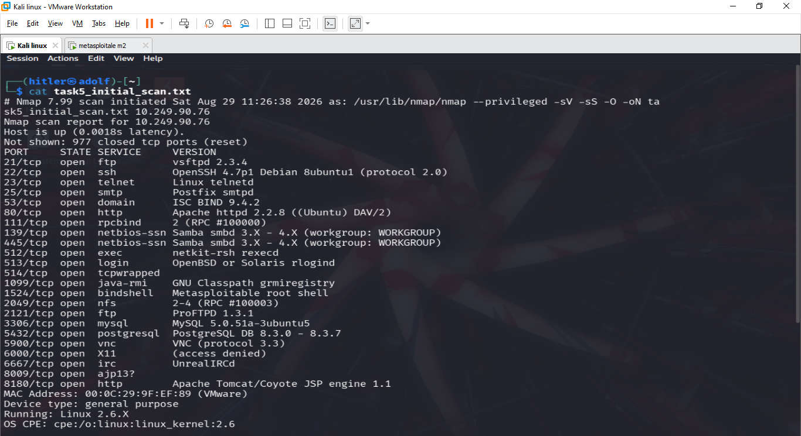
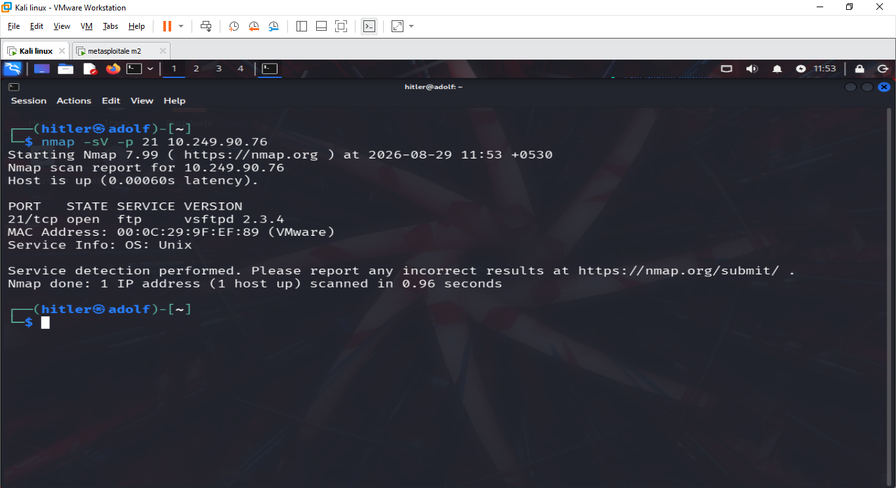
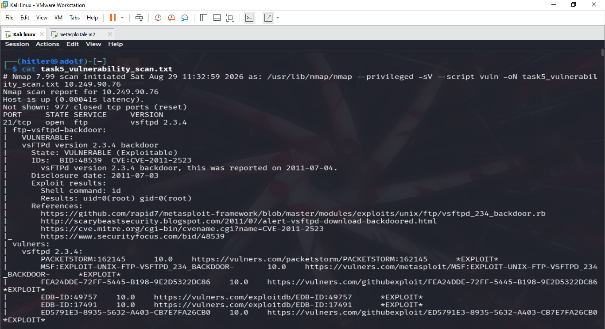
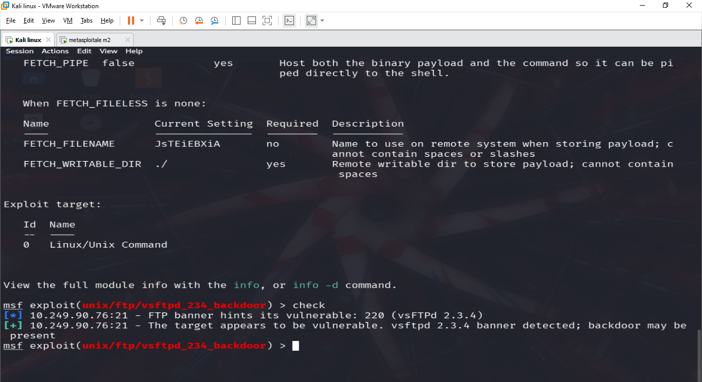
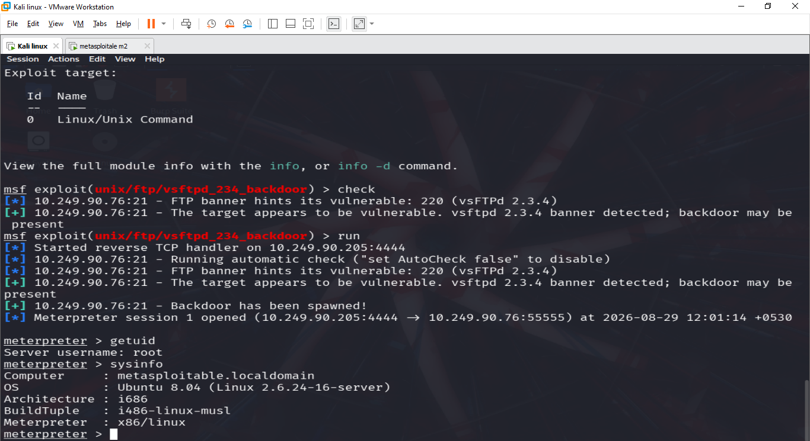
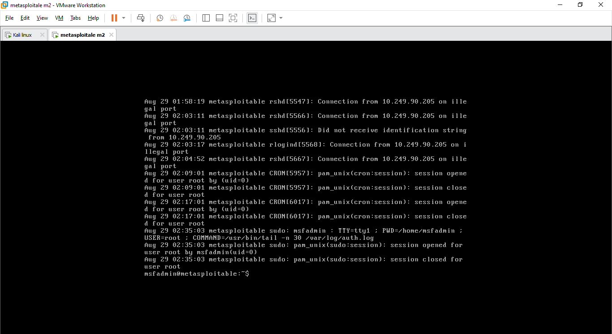
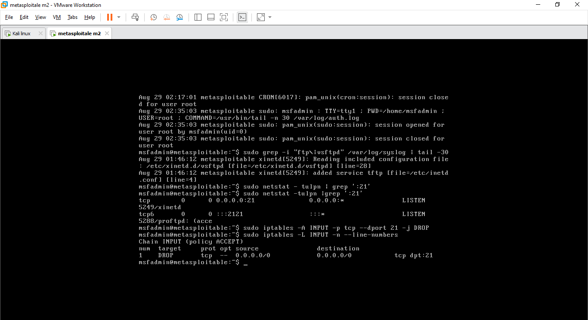
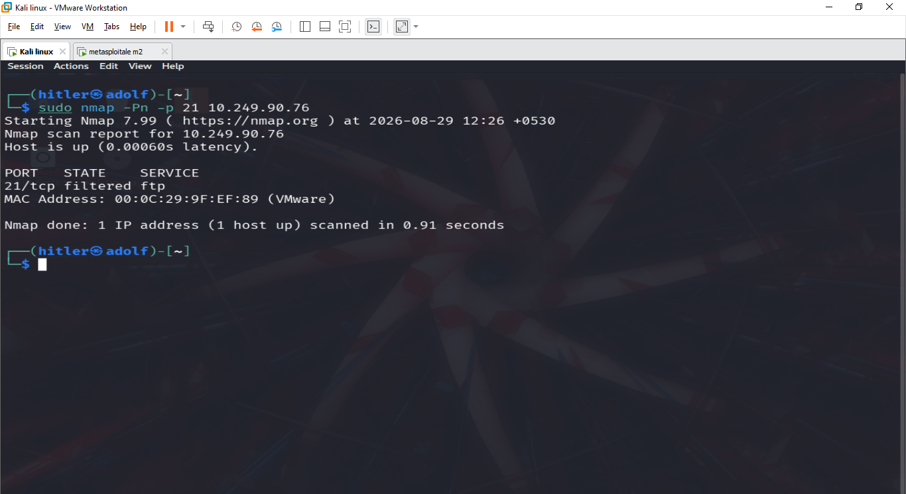

# 🛡️ ApexPlanet Cybersecurity Internship — Task 5

## Capstone Project: Vulnerability Assessment & Incident Response

This repository contains my **Task 5 Capstone Project** completed as part of the **Cybersecurity & Ethical Hacking Internship at ApexPlanet Software Pvt. Ltd.**

The project demonstrates an end-to-end cybersecurity assessment in a controlled lab environment, including:

- Network reconnaissance
- Service enumeration
- Vulnerability assessment
- Controlled exploitation
- Post-exploitation validation
- Log analysis
- Incident response
- Firewall containment
- Post-mitigation verification
- Security recommendations

> ⚠️ **Ethical Use Disclaimer:**  
> All testing documented in this repository was performed in an isolated VMware lab against an intentionally vulnerable Metasploitable2 machine. No public or unauthorized systems were targeted.

---

## 🎯 Project Objective

The objective of this capstone project was to perform a vulnerability assessment of a test network and simulate an incident-response process.

The project follows the workflow:

**Reconnaissance → Scanning → Vulnerability Assessment → Controlled Exploitation → Detection → Containment → Verification → Reporting**

---

## 🧪 Lab Environment

| Component | Details |
|---|---|
| Attacker Machine | Kali Linux |
| Target Machine | Metasploitable2 |
| Attacker IP | `10.249.90.205` |
| Target IP | `10.249.90.76` |
| Virtualization | VMware Workstation |
| Environment | Isolated Lab |
| Primary Vulnerability | vsftpd 2.3.4 Backdoor |
| CVE | CVE-2011-2523 |

---

## 🛠️ Tools Used

- Kali Linux
- Nmap
- Metasploit Framework
- Meterpreter
- Linux system logs
- Netstat
- iptables
- VMware Workstation

---

# 🔍 Assessment Process

## 1. Initial Network Scan

An initial Nmap scan was performed against the Metasploitable2 target to identify exposed ports, services, and service versions.

The scan revealed multiple services including FTP, SSH, Telnet, HTTP, Samba, MySQL, PostgreSQL, VNC, IRC, and Tomcat.



---

## 2. vsftpd Service Detection

A focused version scan of TCP port 21 identified:

```text
21/tcp open ftp vsftpd 2.3.4
```



The outdated FTP service became the primary target for controlled vulnerability validation.

---

## 3. Vulnerability Assessment

Nmap vulnerability scripts identified the **vsftpd 2.3.4 backdoor vulnerability**.

The scan reported the service as:

```text
VULNERABLE
State: Exploitable
CVE: CVE-2011-2523
```



### Primary Finding

| Finding | Severity |
|---|---|
| vsftpd 2.3.4 Backdoor — CVE-2011-2523 | 🔴 Critical |
| Excessive exposed legacy services | 🟠 High |
| Legacy/weak security configurations | 🟠 High / Medium |

---

## 4. Metasploit Vulnerability Validation

The Metasploit Framework was used to validate the identified FTP vulnerability against the authorized lab target.

Module used:

```text
exploit/unix/ftp/vsftpd_234_backdoor
```

The vulnerability check indicated that the target appeared vulnerable.



---

## 5. Controlled Exploitation

The vulnerability was exploited inside the isolated training environment.

A Meterpreter session was successfully established.

Post-exploitation validation showed:

```text
Server username: root
```

System information also confirmed that the compromised system was the intended Metasploitable target.



This demonstrated the critical impact of running the vulnerable FTP service.

---

# 🚨 Incident Response Simulation

After validating the vulnerability, an incident-response workflow was performed.

## 6. Detection & Log Analysis

Authentication and system logs on the target were reviewed to identify suspicious connection activity associated with the assessment.



Log analysis is important for reconstructing attack activity and identifying indicators that can support incident investigation.

---

## 7. Containment

To contain the vulnerable FTP service, a firewall rule was applied to block incoming traffic to TCP port 21.

Example defensive rule:

```bash
sudo iptables -A INPUT -p tcp --dport 21 -j DROP
```

The firewall configuration was then reviewed to verify that the DROP rule had been applied.



---

## 8. Post-Mitigation Verification

After containment, another Nmap scan was performed from Kali Linux.

The result showed:

```text
21/tcp filtered ftp
```



This confirmed that direct access to the vulnerable FTP port was successfully restricted by the network-level control.

---

# 📊 Incident Response Lifecycle

```text
        Vulnerability Detected
                 │
                 ▼
       Controlled Validation
                 │
                 ▼
          Log Investigation
                 │
                 ▼
            Containment
                 │
                 ▼
       Hardening / Mitigation
                 │
                 ▼
       Verification Re-Scan
                 │
                 ▼
          Final Reporting
```

---

# 🔐 Security Recommendations

The following remediation measures are recommended:

1. Remove or upgrade obsolete **vsftpd 2.3.4** installations.
2. Disable unnecessary and legacy network services.
3. Restrict administrative services using firewall rules.
4. Apply operating-system and application security patches regularly.
5. Use network segmentation to reduce attack exposure.
6. Replace insecure legacy remote-access protocols with secure alternatives.
7. Implement strong authentication and credential policies.
8. Centralize security logs and monitor suspicious connection attempts.
9. Perform regular vulnerability assessments.
10. Conduct verification scans after remediation.

---

# 📁 Repository Structure

```text
ApexPlanet-Cybersecurity-Internship-Task-5/
│
├── README.md
│
├── Report/
│   └── Task5_Capstone_Incident_Response_Report.pdf
│
├── Screenshots/
│   ├── 01_initial_nmap_scan.png
│   ├── 02_vsftpd_detection.png
│   ├── 03_vulnerability_scan.png
│   ├── 04_metasploit_check.png
│   ├── 05_exploitation_root_access.png
│   ├── 06_log_analysis.png
│   ├── 07_firewall_containment.png
│   └── 08_post_mitigation_scan.png
│
└── Documentation/
    └── methodology.md
```

---

# 📄 Capstone Report

A detailed penetration-testing and incident-response report documents:

- Executive Summary
- Scope and Objectives
- Methodology
- Reconnaissance
- Vulnerability Assessment
- Controlled Exploitation
- Findings and Risk Assessment
- Incident Response
- Containment
- Mitigation Recommendations
- Post-Incident Analysis
- Evidence and Screenshots

The final report is available in the **`Report/`** directory.

---

# 📚 Key Learning Outcomes

Through this capstone project, I gained practical experience with:

- Network reconnaissance and enumeration
- Vulnerability identification
- CVE-based vulnerability analysis
- Controlled exploitation
- Post-exploitation validation
- Security log investigation
- Incident-response methodology
- Firewall-based containment
- Remediation verification
- Professional cybersecurity reporting

---

## ⚠️ Disclaimer

This repository is intended **strictly for educational and ethical cybersecurity purposes**.

All penetration-testing activities were conducted in a controlled and isolated lab environment using intentionally vulnerable systems. The techniques demonstrated here should only be used against systems for which explicit authorization has been obtained.

---

## 🎓 Internship

**Cybersecurity & Ethical Hacking Internship**  
**ApexPlanet Software Pvt. Ltd.**

**Task 5 — Capstone Project & Incident Response**

---

⭐ This repository documents the completion of the final capstone task and demonstrates the practical application of vulnerability assessment, penetration testing, incident response, mitigation, and security reporting.
